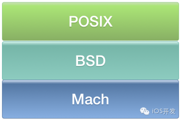
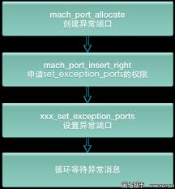

#一 Mach 异常与 Unix 信号
iOS 系统自带的 Apple’s Crash Reporter 记录在设备中的 Crash 日志，Exception Type 项通常会包含两个元素： Mach 异常 和 Unix 信号。  

	Exception Type:         EXC_BAD_ACCESS (SIGSEGV)         
	Exception Subtype:      KERN_INVALID_ADDRESS at 0x041a6f3
	
Mach 异常是什么？它又是如何与 Unix 信号建立联系的？  
Mach 是一个 XNU 的微内核核心，Mach 异常是指最底层的内核级异常，被定义在 <mach/exception_types.h>下 。每个 thread，task，host 都有一个异常端口数组，Mach 的部分 API 暴露给了用户态，用户态的开发者可以直接通过 Mach API 设置 thread，task，host 的异常端口，来捕获 Mach 异常，抓取 Crash 事件。  

所有 Mach 异常都在 host 层被ux_exception转换为相应的 Unix 信号，并通过threadsignal将信号投递到出错的线程。iOS 中的 POSIX API 就是通过 Mach 之上的 BSD 层实现的。  

因此，EXC_BAD_ACCESS (SIGSEGV)表示的意思是：Mach 层的EXC_BAD_ACCESS异常，在 host 层被转换成 SIGSEGV 信号投递到出错的线程。既然最终以信号的方式投递到出错的线程，那么就可以通过注册 signalHandler 来捕获信号:
<pre><code>signal(SIGSEGV,signalHandler);
</code></pre>
捕获 Mach 异常或者 Unix 信号都可以抓到 crash 事件，这两种方式哪个更好呢？优选 Mach 异常，因为 Mach 异常处理会先于 Unix 信号处理发生，如果 Mach 异常的 handler 让程序 exit 了，那么 Unix 信号就永远不会到达这个进程了。转换 Unix 信号是为了兼容更为流行的 POSIX 标准 (SUS 规范)，这样不必了解 Mach 内核也可以通过 Unix 信号的方式来兼容开发。
#一 Crash 收集的实现思路
1. Mach 异常方式  

2. Unix 信号方式
<pre><code>signal(SIGSEGV,signalHandler);
</code></pre>
3. Mach 异常 +Unix 信号方式

SIGSEGV: segmentation violation, accessing memory that you're not allowed to access, 空指针，野指针，readonly的指针
SIGBUS: access memory that can't possibly be there，指针压根不存在
SIGABRT:The process exited abnormally. BSD signal sent by an application to itself when an NSException or obj_exception_throw is not caught.OC中的例子如函数调用超时，对象多次释放